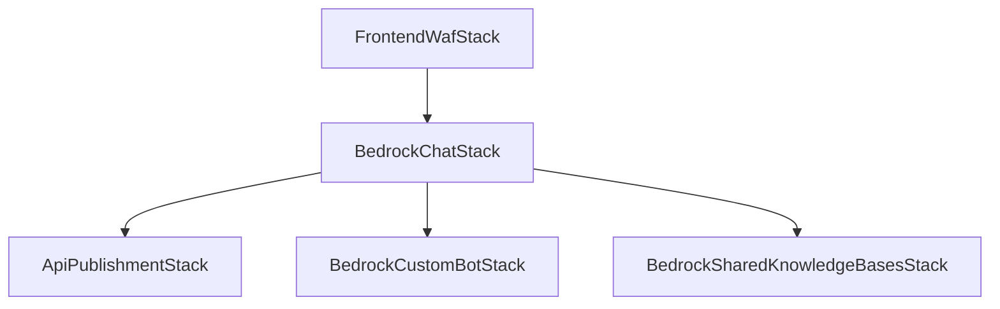

## Overview

Bedrock Chat uses AWS CDK to define and deploy its infrastructure. The application consists of multiple stacks that work together to provide a complete chat solution with RAG capabilities.

## Main Stacks

### BedrockChatStack

The primary application stack that deploys the complete chat infrastructure.

**Stack ID**: `BedrockChatStack`

**Location**: `cdk/lib/bedrock-chat-stack.ts`

**Key Components**:

- **Frontend**: CloudFront distribution with S3 origin for React application
- **Authentication**: Cognito User Pool with optional identity providers (Google, OIDC)
- **Backend API**: HTTP API Gateway with Lambda integration
- **WebSocket**: WebSocket API for streaming responses
- **Database**: DynamoDB tables for conversations, bots, audit logs, and analytics
- **Embedding**: Step Functions state machine for RAG document processing
- **Bot Store**: OpenSearch Serverless collection for bot discovery (optional)

**Stack Properties**:

<ParamField path="envName" type="string" required>
  Environment name (max 10 chars, alphanumeric)
</ParamField>

<ParamField path="envPrefix" type="string" required>
  Prefix for resource names based on environment
</ParamField>

<ParamField path="bedrockRegion" type="string" required>
  AWS region where Bedrock services are available
</ParamField>

<ParamField path="webAclId" type="string" required>
  Web ACL ID for CloudFront distribution protection
</ParamField>

<ParamField path="identityProviders" type="TIdentityProvider[]" required>
  Array of identity provider configurations for SSO
</ParamField>

<ParamField path="enableRagReplicas" type="boolean" required>
  Enable standby replicas for OpenSearch collections
</ParamField>

<ParamField path="enableBedrockGlobalInference" type="boolean" required>
  Enable Bedrock global inference routing
</ParamField>

<ParamField path="enableBedrockCrossRegionInference" type="boolean" required>
  Enable Bedrock cross-region inference
</ParamField>

<ParamField path="enableBotStore" type="boolean" required>
  Enable bot store for sharing and discovering bots
</ParamField>

<ParamField path="bucketPrefix" type="string">
  Prefix for S3 bucket names (lowercase alphanumeric + hyphens)
</ParamField>

**CloudFormation Outputs**:

- `DocumentBucketName`: S3 bucket for document uploads
- `FrontendURL`: Application frontend URL
- `CloudFrontURL`: CloudFront distribution URL
- `ConversationTableNameV3`: DynamoDB conversation table name
- `BotTableNameV3`: DynamoDB bot table name
- `EmbeddingStateMachineArn`: Step Functions ARN for document processing

---

### ApiPublishmentStack

Stack for publishing bot APIs as standalone REST APIs with usage plans and API keys.

**Stack ID**: Dynamic based on published API name

**Location**: `cdk/lib/api-publishment-stack.ts`

**Key Components**:

- **REST API**: API Gateway with Lambda integration
- **SQS Queue**: Message queue for async processing
- **Lambda Handlers**: Docker-based handlers for API and queue processing
- **WAF Integration**: Web ACL association for security

**Stack Properties**:

<ParamField path="bedrockRegion" type="string" required>
  AWS region for Bedrock API calls
</ParamField>

<ParamField path="conversationTableName" type="string" required>
  DynamoDB table for conversations
</ParamField>

<ParamField path="botTableName" type="string" required>
  DynamoDB table for bot configurations
</ParamField>

<ParamField path="tableAccessRoleArn" type="string" required>
  IAM role ARN for DynamoDB access with row-level security
</ParamField>

<ParamField path="webAclArn" type="string" required>
  Web ACL ARN for API Gateway protection
</ParamField>

<ParamField path="usagePlan" type="apigateway.UsagePlanProps" required>
  API Gateway usage plan configuration (throttle, quota, burst limits)
</ParamField>

<ParamField path="largeMessageBucketName" type="string" required>
  S3 bucket for storing large messages exceeding Lambda limits
</ParamField>

**CloudFormation Outputs**:

- `ApiId`: REST API ID
- `ApiName`: REST API name
- `ApiUsagePlanId`: Usage plan ID for API key management
- `DeploymentStage`: API deployment stage name

---

### BedrockCustomBotStack

Stack for creating custom bots with dedicated Knowledge Bases and guardrails.

**Stack ID**: Dynamic based on bot configuration

**Location**: `cdk/lib/bedrock-custom-bot-stack.ts`

**Key Components**:

- **Vector Collection**: OpenSearch Serverless collection for embeddings
- **Vector Index**: Index configuration for semantic search
- **Knowledge Base**: Bedrock Knowledge Base with S3 and web crawler data sources
- **Guardrails**: Bedrock Guardrails for content filtering (optional)

**Stack Properties**:

<ParamField path="ownerUserId" type="string" required>
  User ID of the bot owner
</ParamField>

<ParamField path="botId" type="string" required>
  Unique identifier for the bot
</ParamField>

<ParamField path="bedrockClaudeChatDocumentBucketName" type="string" required>
  S3 bucket containing bot documents
</ParamField>

<ParamField path="embeddingsModel" type="BedrockFoundationModel" required>
  Foundation model for generating embeddings
</ParamField>

<ParamField path="chunkingStrategy" type="ChunkingStrategy" required>
  Strategy for chunking documents (fixed-size, semantic, hierarchical)
</ParamField>

<ParamField path="sourceUrls" type="string[]">
  Array of URLs for web crawler data source
</ParamField>

<ParamField path="guardrail" type="BedrockGuardrailProps">
  Guardrail configuration with thresholds for hate, violence, sexual content, etc.
</ParamField>

**CloudFormation Outputs**:

- `KnowledgeBaseId`: Bedrock Knowledge Base ID
- `KnowledgeBaseArn`: Knowledge Base ARN
- `DataSourceN`: Data source IDs (N = 0, 1, 2...)
- `GuardrailArn`: Guardrail ARN (if configured)
- `GuardrailVersion`: Guardrail version

---

### BedrockSharedKnowledgeBasesStack

Stack for creating shared Knowledge Bases that multiple bots can reference.

**Stack ID**: Dynamic based on configuration

**Location**: `cdk/lib/bedrock-shared-knowledge-bases-stack.ts`

**Key Components**:

- **Shared Knowledge Bases**: Multiple Knowledge Bases from a single stack
- **Custom Transformation**: Lambda function for document preprocessing
- **Temp Bucket**: S3 bucket for transformation intermediate files

**Stack Properties**:

<ParamField path="documentBucketName" type="string" required>
  S3 bucket containing shared documents
</ParamField>

<ParamField path="knowledgeBases" type="BedrockKnowledgeBaseProps[]" required>
  Array of Knowledge Base configurations to create
</ParamField>

<ParamField path="enableRagReplicas" type="boolean">
  Enable standby replicas for high availability
</ParamField>

**CloudFormation Outputs** (per Knowledge Base):

- `KnowledgeBaseId{hash}`: Knowledge Base ID
- `KnowledgeBaseArn{hash}`: Knowledge Base ARN
- `DataSource{hash}0`: Data source ID

---

### FrontendWafStack

Stack for creating Web ACL to protect the CloudFront distribution.

**Stack ID**: `FrontendWafStack`

**Location**: `cdk/lib/frontend-waf-stack.ts`

**Key Components**:

- **IPv4 IP Set**: Allowed IPv4 address ranges
- **IPv6 IP Set**: Allowed IPv6 address ranges
- **Web ACL**: CloudFront-scoped WAF with IP-based rules

**Stack Properties**:

<ParamField path="envPrefix" type="string" required>
  Environment prefix for resource naming
</ParamField>

<ParamField path="allowedIpV4AddressRanges" type="string[]" required>
  Array of allowed IPv4 CIDR ranges
</ParamField>

<ParamField path="allowedIpV6AddressRanges" type="string[]" required>
  Array of allowed IPv6 CIDR ranges
</ParamField>

**CloudFormation Outputs**:

- `WebAclId`: Web ACL ARN for CloudFront association

---

## Stack Dependencies

## Deployment Order

1. **FrontendWafStack** (if `enableFrontendWaf` is true)
2. **BedrockChatStack** (main application)
3. **BedrockCustomBotStack** (deployed dynamically via CodeBuild when users create bots)
4. **BedrockSharedKnowledgeBasesStack** (deployed via CodeBuild when shared KBs are configured)
5. **ApiPublishmentStack** (deployed via CodeBuild when users publish bot APIs)

## Region Requirements

- **FrontendWafStack**: Must deploy to `us-east-1` (CloudFront requirement)
- **BedrockChatStack**: Deploy to any AWS region supporting required services
- **Other Stacks**: Deploy to the same region as BedrockChatStack
