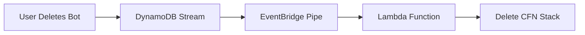
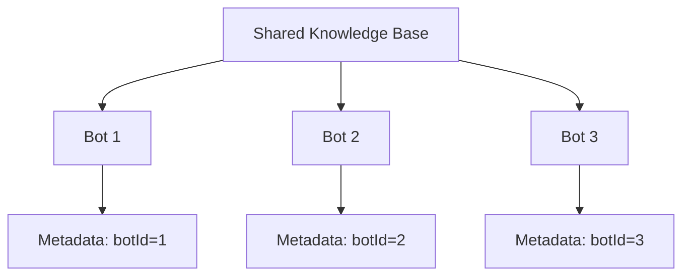
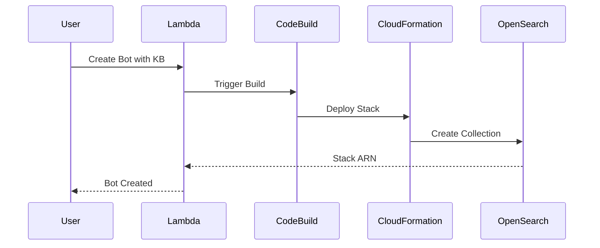
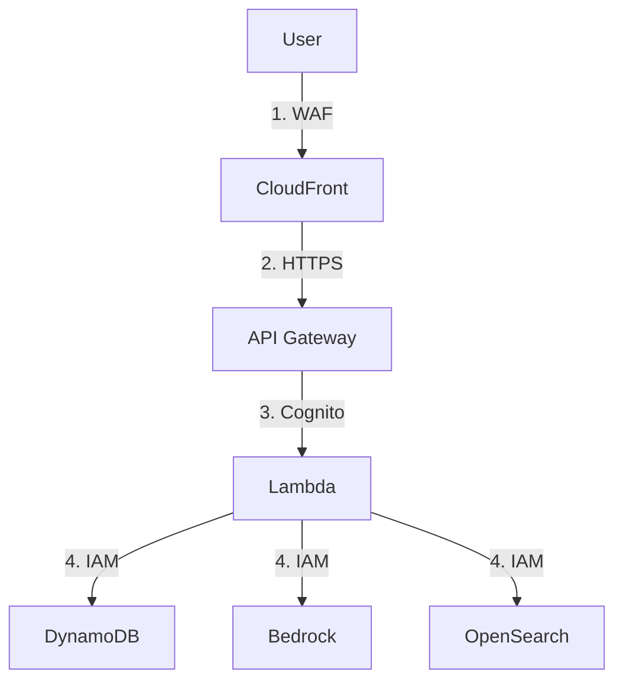
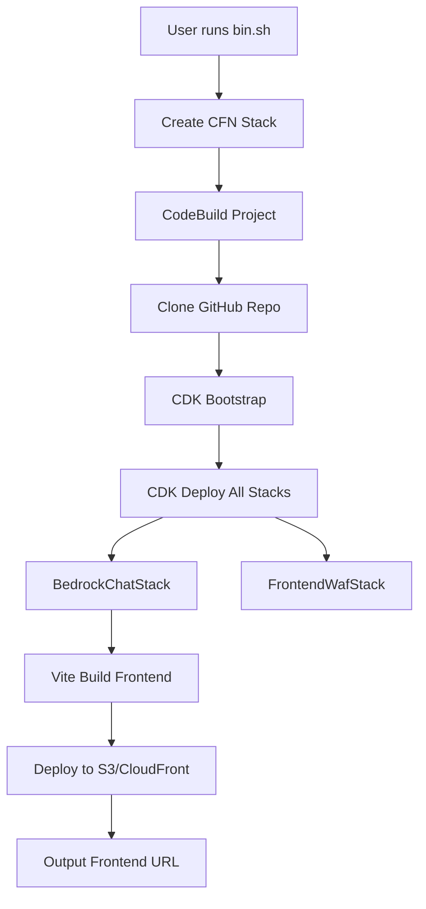
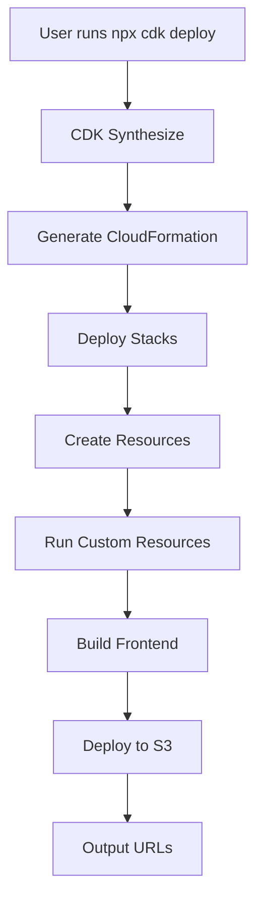

## Architecture Overview

Bedrock Chat is built on a serverless, fully managed AWS architecture that eliminates infrastructure management while providing scalability, reliability, and security. All AI model interactions happen through Amazon Bedrock within your AWS account—no data leaves AWS.


## Core AWS Services

Bedrock Chat leverages the following AWS managed services:

### Frontend Layer

<AccordionGroup>
  <Accordion title="Amazon CloudFront" icon="cloud">
    **Purpose**: Global content delivery network (CDN) for the frontend application
    
    **Features**:
    - Automatic HTTPS encryption
    - Global edge locations for low latency
    - Custom domain support with Route 53
    - Geo-restriction capabilities
    - IPv6 support (configurable)
    
    **Usage in Bedrock Chat**: Delivers the React frontend application globally with caching and edge acceleration.
  </Accordion>
  
  <Accordion title="Amazon S3" icon="database">
    **Purpose**: Static asset storage and document hosting
    
    **Buckets**:
    - **Frontend bucket**: Stores compiled React application (Vite build output)
    - **Document bucket**: Stores uploaded documents for knowledge bases
    - **Access logs bucket**: Stores CloudFront and S3 access logs
    - **Large message bucket**: Stores oversized WebSocket messages
    - **Source bucket**: Stores CDK source code for CodeBuild
    
    **Security**: All buckets use S3-managed encryption, block public access, and enforce SSL.
  </Accordion>
  
  <Accordion title="AWS WAF" icon="shield">
    **Purpose**: Web Application Firewall for traffic filtering
    
    **WebACLs**:
    - **Frontend WAF**: Protects CloudFront distribution (us-east-1)
    - **Cognito WAF**: Protects Cognito endpoints (regional)
    - **Published API WAF**: Protects published bot APIs (regional)
    
    **Rules**:
    - IP allowlist/denylist (IPv4/IPv6)
    - Geographic restrictions (country-based)
    - Rate limiting
    - Common web exploits protection
  </Accordion>
</AccordionGroup>

### Authentication & Authorization

<AccordionGroup>
  <Accordion title="Amazon Cognito" icon="user-lock">
    **Purpose**: User authentication and authorization
    
    **Components**:
    - **User Pool**: Manages user identities, registration, and sign-in
    - **User Pool Client**: Configures authentication flows
    - **User Groups**:
      - `Admin` - Administrative access
      - `CreatingBotAllowed` - Can create custom bots
      - `PublishAllowed` - Can publish bot APIs
    
    **Features**:
    - Self-registration (configurable)
    - Email domain restrictions
    - External identity providers (Google, OIDC)
    - MFA support
    - Token-based authentication with configurable expiration
    
    **Integration**: Uses AWS Amplify in frontend for authentication flows.
  </Accordion>
</AccordionGroup>

### Backend API Layer

<AccordionGroup>
  <Accordion title="Amazon API Gateway" icon="server">
    **Purpose**: RESTful API endpoints for backend services
    
    **APIs**:
    - **Backend API**: Main REST API for application logic
    - **WebSocket API**: Real-time streaming for chat responses
    - **Published APIs**: Dynamically created APIs for published bots
    
    **Features**:
    - Cognito authorizer integration
    - Request/response validation
    - CORS configuration
    - CloudWatch logging
    - Throttling and quotas
  </Accordion>
  
  <Accordion title="AWS Lambda" icon="bolt">
    **Purpose**: Serverless compute for API handlers
    
    **Functions**:
    - **API Handler**: FastAPI application via Lambda Web Adapter
    - **WebSocket Handler**: Handles WebSocket connections and streaming
    - **Custom resource handlers**: CDK custom resources
    
    **Runtime**: Python with [AWS Lambda Web Adapter](https://github.com/awslabs/aws-lambda-web-adapter) for FastAPI
    
    **Optimizations**:
    - Lambda SnapStart for Python (configurable)
    - Provisioned concurrency for hot starts
    - Environment variables for configuration
    - VPC integration for OpenSearch access
    
    **Dependencies**:
    - FastAPI for REST endpoints
    - Boto3 for AWS SDK
    - LangChain for agent orchestration
  </Accordion>
</AccordionGroup>

### Data Layer

<AccordionGroup>
  <Accordion title="Amazon DynamoDB" icon="table">
    **Purpose**: NoSQL database for application data
    
    **Tables**:
    - **Conversation Table**: Stores chat conversations and messages
    - **Bot Table**: Stores custom bot configurations and metadata
    - **Export Table**: Staging table for analytics exports
    
    **Features**:
    - On-demand capacity mode (auto-scaling)
    - Point-in-time recovery (PITR) enabled
    - DynamoDB Streams for event processing
    - Single-table design with composite keys
    
    **Data Model**:
    ```
    PK: USER#{userId} or BOT#{botId}
    SK: CONVERSATION#{conversationId} or BOT#{botId}
    ```
  </Accordion>
  
  <Accordion title="Amazon OpenSearch Serverless" icon="magnifying-glass">
    **Purpose**: Vector database and full-text search for knowledge bases
    
    **Collections**:
    - **Knowledge Base Collections**: Per-bot or multi-tenant collections for RAG
    - **Bot Store Collection**: Search and discovery for bot marketplace
    
    **Features**:
    - Vector search with k-NN
    - Full-text search with BM25
    - Automatic scaling (OCU-based)
    - Data access policies (IAM-based)
    - Optional standby replicas for high availability
    
    **Cost Optimization**:
    - Multi-tenant mode shares collections across bots
    - Configurable replicas (`enableRagReplicas`, `enableBotStoreReplicas`)
    - Starts at 0.5 OCU for small workloads
  </Accordion>
</AccordionGroup>

### AI & Machine Learning

<AccordionGroup>
  <Accordion title="Amazon Bedrock" icon="sparkles">
    **Purpose**: Managed foundation models API
    
    **Supported Models**:
    - **Claude**: v4-opus, v4.5-opus, v3.7-sonnet, v3.5-sonnet, v3.5-haiku
    - **Amazon Nova**: nova-pro, nova-lite, nova-micro
    - **Llama**: llama3-3-70b-instruct, llama3-2-90b-instruct
    - **Mistral**: mistral-large-2, mixtral-8x7b-instruct
    - **DeepSeek**: deepseek-r1
    
    **Features**:
    - Streaming responses
    - Cross-region inference (configurable)
    - Global inference profiles
    - Usage metrics and logging
    - Model access controls per region
    
    **API Integration**: Uses Boto3 `bedrock-runtime` client with converse API.
  </Accordion>
  
  <Accordion title="Amazon Bedrock Knowledge Bases" icon="book">
    **Purpose**: Managed RAG (Retrieval-Augmented Generation) service
    
    **Components**:
    - **Data Source**: S3 bucket with document ingestion
    - **Embedding Model**: Amazon Titan Embeddings
    - **Vector Store**: OpenSearch Serverless
    - **Ingestion Pipeline**: Step Functions orchestration
    
    **Features**:
    - Automatic document parsing (PDF, TXT, HTML, DOCX, etc.)
    - Chunking and embedding
    - Metadata filtering (multi-tenant support)
    - Synchronization jobs
    - Import existing Knowledge Bases
    
    **Multi-Tenant Mode**: Filters documents using Bot ID metadata to share Knowledge Bases across multiple bots.
  </Accordion>
</AccordionGroup>

### Orchestration & Automation

<AccordionGroup>
  <Accordion title="AWS Step Functions" icon="diagram-project">
    **Purpose**: Orchestrate multi-step workflows
    
    **State Machines**:
    - **Embedding State Machine**: Orchestrates document ingestion pipeline
      1. Trigger Knowledge Base sync
      2. Monitor sync status
      3. Update DynamoDB with completion status
      4. Handle failures and retries
    
    **Integration**: Invoked by Lambda functions when users upload documents or create bots.
  </Accordion>
  
  <Accordion title="Amazon EventBridge Pipes" icon="arrows-turn-right">
    **Purpose**: Event-driven automation
    
    **Pipes**:
    - **Bot Deletion Pipe**: 
      - Source: DynamoDB Streams (Bot Table)
      - Filter: Deletion events
      - Target: Lambda to delete CloudFormation stack
    
    **Use Case**: Automatically clean up Knowledge Base CloudFormation stacks when bots are deleted.
  </Accordion>
  
  <Accordion title="AWS CodeBuild" icon="code">
    **Purpose**: CI/CD for dynamic infrastructure
    
    **Projects**:
    - **API Publish CodeBuild**: Creates CloudFormation stacks for published bot APIs
    - **Bedrock Custom Bot CodeBuild**: Creates CloudFormation stacks for bot Knowledge Bases
    - **Bedrock Shared KB CodeBuild**: Creates shared multi-tenant Knowledge Base stacks
    
    **Workflow**:
    1. Lambda triggers CodeBuild with parameters
    2. CodeBuild synthesizes CDK stack
    3. CDK deploys CloudFormation stack
    4. Outputs returned to Lambda
    
    **IAM**: CodeBuild has permissions to create nested stacks with limited scope.
  </Accordion>
</AccordionGroup>

### Analytics & Monitoring

<AccordionGroup>
  <Accordion title="Amazon Athena" icon="chart-line">
    **Purpose**: SQL query service for analytics
    
    **Data Sources**:
    - DynamoDB exports to S3 (via PITR)
    - CloudFront access logs
    - API Gateway logs
    
    **Queries**:
    - Bot usage statistics
    - Conversation analytics
    - User activity metrics
    - Cost analysis
    
    **Tables**: Managed by AWS Glue Data Catalog with partitioning.
  </Accordion>
  
  <Accordion title="AWS Glue" icon="database">
    **Purpose**: Data catalog and ETL
    
    **Components**:
    - **Glue Database**: Metadata catalog for DynamoDB exports
    - **Glue Tables**: Schema definitions for analytics queries
    - **Glue Crawlers**: (Optional) Discover new data partitions
    
    **Integration**: Athena uses Glue catalog to query exported DynamoDB data.
  </Accordion>
  
  <Accordion title="Amazon CloudWatch" icon="bell">
    **Purpose**: Monitoring, logging, and alarms
    
    **Logs**:
    - Lambda function logs
    - API Gateway access logs
    - CodeBuild build logs
    - Step Functions execution logs
    
    **Metrics**:
    - Lambda invocations, duration, errors
    - API Gateway requests, latency
    - DynamoDB read/write units
    - OpenSearch OCU usage
    
    **Retention**: Configurable log retention (default: 3 months)
  </Accordion>
</AccordionGroup>

## Architecture Patterns

### Serverless Architecture

<Card title="Zero Infrastructure Management" icon="check">
  All components are fully managed AWS services:
  - No EC2 instances to patch or maintain
  - Automatic scaling based on demand
  - Pay-per-use pricing model
  - Built-in high availability
</Card>

### Event-Driven Design



EventBridge Pipes react to DynamoDB changes to trigger cleanup workflows.

### Infrastructure as Code

All infrastructure is defined using AWS CDK (TypeScript):

```typescript
// Example: CDK Stack Definition
const database = new Database(this, "Database", {
  pointInTimeRecovery: true,
});

const backendApi = new Api(this, "BackendApi", {
  database,
  bedrockRegion: props.bedrockRegion,
  enableLambdaSnapStart: true,
});
```

**Benefits**:
- Version control for infrastructure
- Repeatable deployments
- Multi-environment support (`parameter.ts`)
- Type-safe configuration

### Multi-Tenant Knowledge Bases



Metadata filtering isolates data while sharing infrastructure:

```python
# Query with metadata filter
response = bedrock_agent_runtime.retrieve(
    knowledgeBaseId=shared_kb_id,
    retrievalQuery={"text": query},
    retrievalConfiguration={
        "vectorSearchConfiguration": {
            "filter": {"equals": {"key": "botId", "value": bot_id}}
        }
    }
)
```

### Dynamic Stack Creation

CodeBuild creates nested CloudFormation stacks on-demand:



**Stacks**:
- `BrChatKbStack-{botId}`: Knowledge Base per bot
- `ApiPublishmentStack-{apiId}`: Published bot API
- `BedrockSharedKbStack`: Multi-tenant Knowledge Base

## Security Architecture

### Defense in Depth



**Security Layers**:
1. **WAF**: IP filtering, geo-restrictions, rate limiting
2. **HTTPS**: TLS encryption in transit
3. **Cognito**: User authentication and authorization
4. **IAM**: Least-privilege service permissions
5. **Encryption**: At-rest encryption for all storage services

### IAM Roles & Policies

<AccordionGroup>
  <Accordion title="Lambda Execution Role">
    **Permissions**:
    - DynamoDB read/write (specific tables)
    - S3 read/write (specific buckets)
    - Bedrock InvokeModel
    - OpenSearch data access (via data access policies)
    - CloudWatch Logs write
    - Step Functions start execution
  </Accordion>
  
  <Accordion title="CodeBuild Service Role">
    **Permissions**:
    - CloudFormation create/update/delete stack
    - IAM create/update role (scoped to specific paths)
    - OpenSearch create collection
    - Bedrock create Knowledge Base
    - S3 read source bucket
  </Accordion>
  
  <Accordion title="DynamoDB Stream Role">
    **Permissions**:
    - DynamoDB Streams read
    - Lambda invoke (for EventBridge Pipes target)
  </Accordion>
</AccordionGroup>

### Data Isolation

- **Per-User Data**: DynamoDB partition key includes user ID
- **Per-Bot Data**: OpenSearch metadata filtering by bot ID
- **Cognito Groups**: Control access to bot creation and publishing
- **API Gateway Authorizer**: Validates JWT tokens from Cognito

## Scalability & Performance

### Auto-Scaling Components

| Service | Scaling Method | Limits |
|---------|---------------|--------|
| Lambda | Concurrent executions | 1000 (default), request increase |
| DynamoDB | On-demand capacity | Unlimited |
| API Gateway | Automatic | 10,000 RPS (default) |
| OpenSearch | OCU-based | 2-100 OCU per collection |
| CloudFront | Global edge network | Unlimited |

### Performance Optimizations

<CardGroup cols={2}>
  <Card title="Lambda SnapStart" icon="bolt">
    Reduces cold start times by 50-90% for Python functions
  </Card>
  <Card title="CloudFront Caching" icon="clock">
    Caches static assets at edge locations globally
  </Card>
  <Card title="DynamoDB Streams" icon="stream">
    Processes changes asynchronously for analytics
  </Card>
  <Card title="WebSocket Streaming" icon="water">
    Real-time token-by-token response streaming
  </Card>
</CardGroup>

## Cost Optimization

### Cost Drivers

1. **Amazon Bedrock**: Pay-per-token (input/output)
2. **OpenSearch Serverless**: OCU-hours
3. **Lambda**: Invocations + GB-seconds
4. **DynamoDB**: Read/write capacity (on-demand)
5. **CloudFront**: Data transfer out

### Cost Reduction Strategies

<Tip>
  **Multi-Tenant Knowledge Bases**: Share OpenSearch collections across bots to reduce OCU costs from 2 OCU per bot to 2 OCU for all bots.
</Tip>

<Tip>
  **Disable Replicas**: Set `enableRagReplicas: false` in `cdk.json` for dev/test environments to use 1 OCU instead of 2.
</Tip>

<Tip>
  **Use Cheaper Models**: Configure `titleModel: "claude-v3-haiku"` or `"amazon-nova-lite"` for conversation title generation.
</Tip>

<Tip>
  **Lambda SnapStart**: Trade cache storage costs for reduced execution time (faster = cheaper).
</Tip>

## High Availability

### Regional Resilience

- **Multi-AZ**: All services (Lambda, DynamoDB, API Gateway) run across multiple Availability Zones
- **OpenSearch Replicas**: Optional standby replicas for Knowledge Bases
- **CloudFront**: Global edge network with automatic failover
- **S3**: 99.999999999% durability with cross-AZ replication

### Disaster Recovery

- **DynamoDB PITR**: Point-in-time recovery within last 35 days
- **S3 Versioning**: Can be enabled for document buckets
- **CloudFormation Stacks**: IaC enables rapid redeployment
- **Cross-Region**: Deploy to multiple regions with separate stacks

## Deployment Architecture

### CloudShell Deployment Flow



### CDK Deployment Flow



## Tech Stack Summary

### Frontend

- **Framework**: React 18
- **Build Tool**: Vite
- **Styling**: Tailwind CSS
- **State Management**: Zustand, XState
- **Authentication**: AWS Amplify
- **API Client**: Axios, SWR
- **Markdown**: React Markdown with syntax highlighting

### Backend

- **Runtime**: Python 3.12
- **Framework**: FastAPI
- **Adapter**: AWS Lambda Web Adapter
- **AWS SDK**: Boto3
- **Agent Framework**: LangChain
- **Database**: DynamoDB (Boto3)

### Infrastructure

- **IaC**: AWS CDK (TypeScript)
- **Language**: Node.js 20
- **Package Manager**: npm
- **Testing**: Jest

## Next Steps

<CardGroup cols={2}>
  <Card title="Deploy Bedrock Chat" icon="rocket" href="/quickstart">
    Follow the quickstart guide to deploy the architecture
  </Card>
  <Card title="CDK Deep Dive" icon="code" href="/deployment/cdk">
    Learn about advanced CDK deployment options
  </Card>
  <Card title="Configuration" icon="gear" href="/configuration/advanced">
    Configure architecture parameters and optimizations
  </Card>
  <Card title="Custom Development" icon="wrench" href="/development/local-setup">
    Set up local development environment
  </Card>
</CardGroup>
