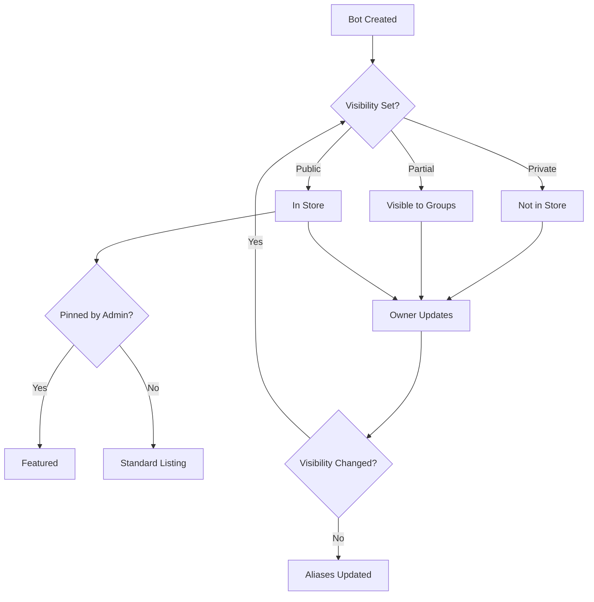

The Bot Store is a marketplace where users can discover, share, and use custom bots created by others in your organization. It enables collaboration and knowledge sharing by making specialized AI assistants available to everyone.

## Overview

The Bot Store provides:

- **Discovery**: Search and browse available bots
- **Quick Access**: One-click bot installation
- **Filtering**: Find bots by capability, topic, or creator
- **Pinning**: Administrators can feature essential bots

<Note>
Only bots with `shared_scope = "all"` or `shared_scope = "partial"` (with appropriate permissions) appear in the Bot Store.
</Note>

## Architecture

The Bot Store is powered by OpenSearch Serverless for fast, flexible search:

```
DynamoDB Streams → EventBridge → Lambda → OpenSearch Serverless
                                            ↓
                                    Search API ← Frontend
```

- Bot creation/updates trigger indexing
- Full-text search across title, description, and instruction
- Real-time updates via DynamoDB Streams
- Fuzzy matching for typo tolerance

## Publishing a Bot to the Store

### Making a Bot Public

1. Create or edit your bot
2. Set visibility to **Public** (all users)
3. Ensure bot has:
   - Clear, descriptive title
   - Helpful description
   - Tested and working knowledge/tools
4. Save changes

The bot appears in the store immediately after sync completes.

### Partial Sharing

Share with specific users or groups:

```python
{
  "shared_scope": "partial",
  "allowed_cognito_groups": ["Engineering", "Sales"],
  "allowed_cognito_users": ["user123"]
}
```

The bot is only visible to:
- Users in specified Cognito groups
- Explicitly allowed users
- Administrators
- The bot owner

## Discovering Bots

### Search

The Bot Store supports powerful search:

- **Full-text search**: Searches title, description, and instruction
- **Fuzzy matching**: Tolerates typos and variations
- **Multi-language**: Supports multiple languages based on deployment config

Example search query:
```
"customer support documentation"
```

Finds bots with any of these terms in their metadata.

### Access Control in Search

Search results automatically filter based on user permissions:

<Accordion title="Search Filtering Logic">
```python
# Bots shown in search results:
1. Public bots (shared_scope = "all")
2. Your private bots
3. Partial shared bots where:
   - You are in allowed_cognito_groups, OR
   - You are in allowed_cognito_users, OR
   - You are an administrator
```
</Accordion>

### Filtering Options

- **Owned**: Show only bots you created
- **Starred**: Show only starred bots
- **Recently Used**: Sort by last use
- **Pinned**: Show administrator-featured bots

## Using Bots from the Store

### Installing a Bot

1. Find a bot in the store
2. Click to view details:
   - Description and capabilities
   - Knowledge sources (if any)
   - Available tools (if agent enabled)
   - Quick starter examples
3. Click **Use Bot** or **Add to My Bots**

The bot is added to your bot list as an alias:

```python
{
  "original_bot_id": "bot123",
  "owner_user_id": "creator_user_id",
  "title": "Bot Title",
  "is_starred": False,  # You can star independently
  "last_used_time": timestamp
}
```

<Note>
You use an alias that points to the original bot. Changes by the bot owner are reflected in your alias automatically.
</Note>

### Alias Management

- **Star/Unstar**: Mark as favorite (independent of original)
- **Remove**: Delete the alias (doesn't affect original bot)
- **Sync Status**: Inherits from original bot

## Administrator Features

### Pinning Bots

Administrators can feature essential bots:

```python
shared_status = "pinned@001"  # 001-999
```

Pinned bots:
- Appear at the top of search results
- Highlighted with special badge
- Suggested to new users

<Note>
The number after `@` determines pin order (001 = highest priority).
</Note>

### Bot Analytics

Administrators can view:

- Usage statistics per bot
- Most popular bots
- User engagement metrics
- Token consumption

See [Administrator documentation](/admin/analytics) for details.

## OpenSearch Configuration

### Language Settings

Optimize search for your primary language:

```json
{
  "botStoreLanguage": "en"  // English (default)
}
```

Supported languages: `en`, `ja`, `es`, `fr`, `de`, `zh`, `ko`, and more.

This affects:
- Text analysis and tokenization
- Search relevance ranking
- Stemming and stop words

### Replica Configuration

Control availability and cost:

```json
{
  "enableBotStoreReplicas": false  // Dev/Test
  // or
  "enableBotStoreReplicas": true   // Production
}
```

<Note>
This setting cannot be changed after the collection is created. Plan accordingly during deployment.
</Note>

## Bot Store Best Practices

<CardGroup cols={2}>
  <Card title="Clear Descriptions" icon="file-lines">
    Write clear, specific descriptions that explain what the bot does and when to use it.
  </Card>
  
  <Card title="Test Thoroughly" icon="vial">
    Test your bot extensively before making it public. Ensure knowledge and tools work correctly.
  </Card>
  
  <Card title="Add Examples" icon="message">
    Include conversation quick starters to help users understand bot capabilities.
  </Card>
  
  <Card title="Maintain Bots" icon="wrench">
    Update bot knowledge and instructions regularly. Users automatically get improvements.
  </Card>
</CardGroup>

## Search Examples

<Accordion title="Finding Customer Support Bots">
Search: `customer support help desk`

Finds bots with:
- "Customer Support" in title
- "Help desk" in description
- Support-related instructions
</Accordion>

<Accordion title="Finding Technical Bots">
Search: `python programming code`

Finds bots for:
- Python development
- Code generation
- Technical documentation
</Accordion>

<Accordion title="Finding Department Bots">
Search: `sales marketing team`

Finds bots shared with:
- Sales team
- Marketing department
- Cross-functional groups
</Accordion>

## Bot Lifecycle in Store



## Removing Bots from Store

To remove a bot from the store:

1. Edit the bot
2. Change visibility to **Private**
3. Save changes

Effects:
- Bot removed from search results immediately
- Existing aliases remain functional
- Users can still use the bot until they remove the alias
- Original owner retains full access

<Note>
Deleting a bot removes all aliases and makes the bot unavailable to all users.
</Note>

## Usage Tracking

Bots track usage statistics:

```python
usage_stats = {
  "usage_count": 42  # Number of times used
}
```

Visible to:
- Bot owner (always)
- Administrators (all bots)

Used for:
- Analytics and reporting
- Identifying popular bots
- Understanding user needs

## Search Performance

### Indexing

- Automatic via DynamoDB Streams
- Near real-time (seconds)
- Full reindexing not required

### Query Performance

- Sub-second search response
- Handles concurrent users
- Auto-scales with demand

## Troubleshooting

<Accordion title="Bot Not Appearing in Store">
Check:
- Sync status is `SUCCEEDED`
- `shared_scope` is set to `"all"` or `"partial"`
- For partial: User is in allowed groups/users
- Bot has a description (improves discoverability)
</Accordion>

<Accordion title="Search Not Finding Bot">
- Wait a few seconds for indexing
- Try simpler search terms
- Check bot's title/description contains search terms
- Verify bot is actually public/accessible
</Accordion>

<Accordion title="Alias Not Updating">
- Aliases update automatically when owner modifies bot
- Wait for original bot's sync to complete
- Refresh your bot list
</Accordion>

## Next Steps

<CardGroup cols={2}>
  <Card title="Create a Bot" href="/features/custom-bots" icon="robot">
    Build a bot to share in the store
  </Card>
  
  <Card title="Publish API" href="/features/api-publishing" icon="code">
    Create a standalone API from your bot
  </Card>
  
  <Card title="Administrator Guide" href="/administration/overview" icon="shield">
    Learn about admin features and analytics
  </Card>
  
  <Card title="Usage Analytics" href="/administration/analytics" icon="chart-line">
    Track bot usage and engagement
  </Card>
</CardGroup>